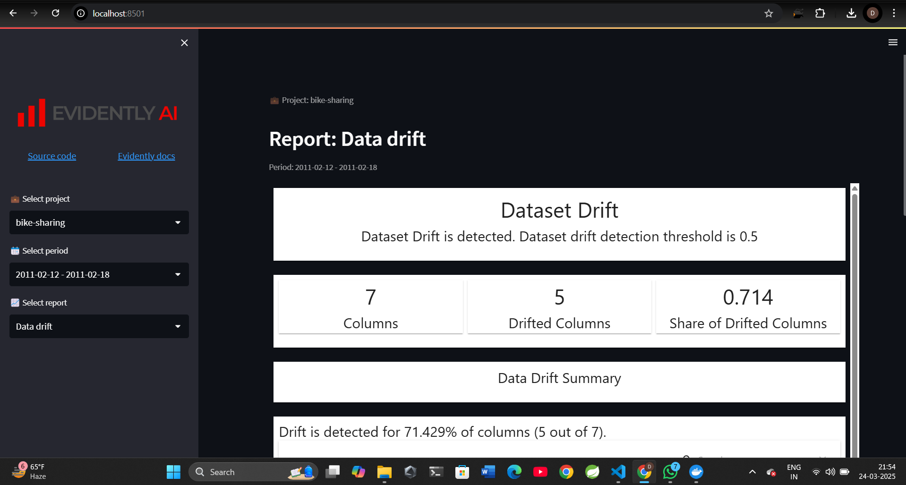

# 🚀 ML Model with Evidently - Dockerized Streamlit App

## 📌 Overview
This repository contains a **Dockerized Streamlit application** for running an ML model with **Evidently AI**. The setup ensures seamless deployment and execution of the model within a containerized environment.

## 📂 Project Structure
```
📦 Docker_Practices
├── 📂 app          # Streamlit application
├── 📂 projects     # ML model & related files
├── 📜 requirements.txt  # Python dependencies
├── 📜 Dockerfile   # Docker configuration
└── 📜 app.py       # Main Streamlit application
```

## 🛠️ Setup & Installation
### 🔹 Clone the Repository
```bash
 git clone https://github.com/Aditya5757raj/Docker_Practices.git
 cd Docker_Practices
```

### 🔹 Build & Run the Docker Container
```bash
 docker build -t streamlit-ml-app .
 docker run -p 8507:8507 streamlit-ml-app
```

## 📌 Usage
Once the container is running, open **http://localhost:8507** in your browser to access the Streamlit ML dashboard.

## 📸 Result
Below is the output of the Streamlit dashboard:




---
🌟 *Don't forget to star ⭐ the repo if you find it helpful!*

